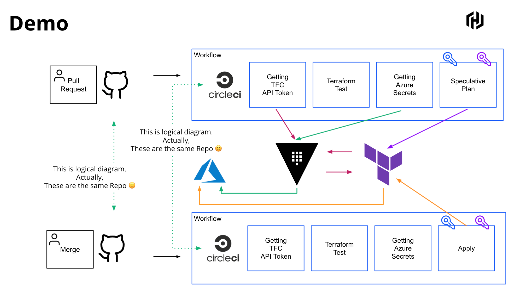
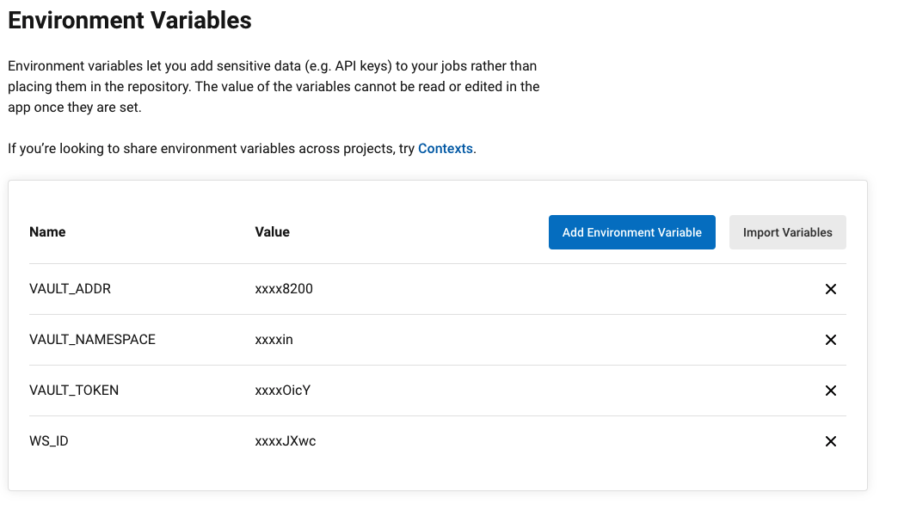

## preparation

```shell
git clone thisrepo
cd thisrepo
```

### Vault Setup
```
 vault secrets enable -path=tfc terraform
 vault secrets enable -path=secret/ kv-v2
 vaukt secrets enable azure
 vault write tfc/role/ci-user user_id=user-xxxxxxxx ttl=3m
 vault write tfc/config token=xxxxxxxxx
 vault kv put secret/azure/environment \
    subscription_id="" \
    tenant_id=""
 vault write azure/config \
    subscription_id="${SUB_ID}" \
    client_id="${CLIENT_ID}" \
    client_secret="${CLIENT_SECRET}" \
    tenant_id="${TENANT_ID}"
vault write azure/roles/contributor ttl=10m azure_roles=-<<EOF
    [
      {
        "role_name": "Contributor",
        "scope": "/subscriptions/${SUB_ID}/resourceGroups/${RESOURCE_ID}"
      }
    ]
EOF
vault policy write azure-read policy.hcl
vault token create -policy azure-read -orphan
```

### Circle CI $ TFC Setup
* Make a project and select thisrepo
* Init Secrets


* Make a workspace and select API Driven Workflow
* Choose TF 1.0.6

### test
* modify main.tf as you would like to do
* git
```shell
git branch -M dev
git add main.tf
git commit -m "comment"
git push -u origin dev 
```

* Speculative Plan's URL will be output in the Circle CI's log
* Check Speculative plan
* Merge to main branch
* See the TFC workspace
